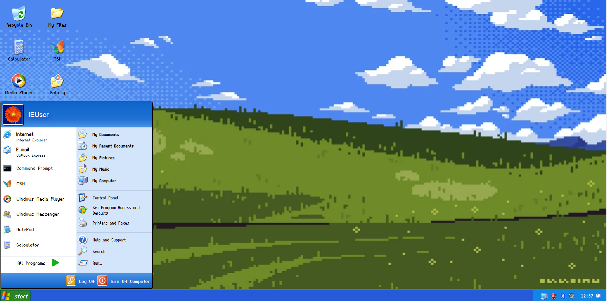
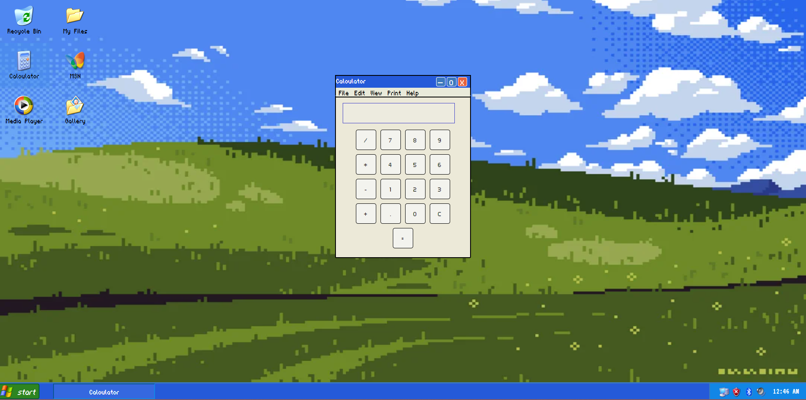
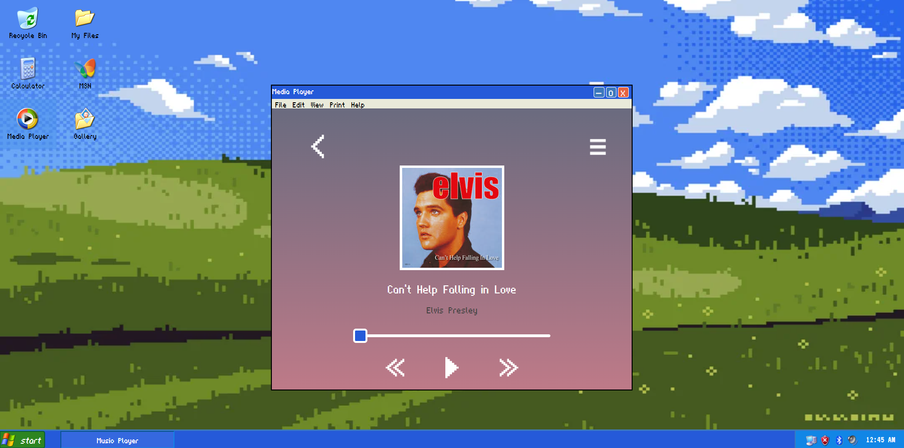
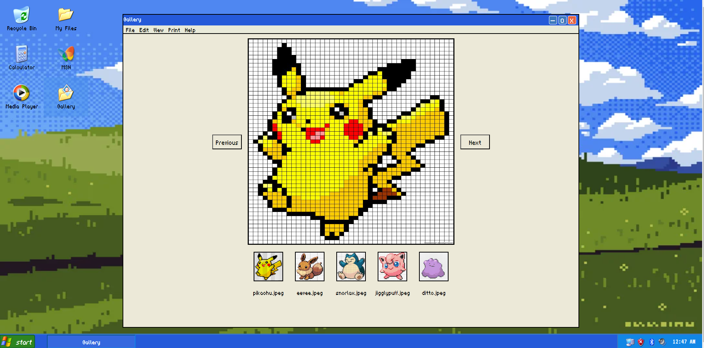

# FakeOS Project: WindowsXP
A recreation of an old operating system on the web! Features the classic WindowsXP design with a small pixel twist. Includes three small applications to run (calculator, music player and gallery). A project to practice HTML, SCSS and Javascript DOM manipulation skills. 

Deployed Link: [FakeOS--WindowsXP](https://fake-os-three.vercel.app/)

## Key Features
- Three selectable icons which run simple applications
- Ability to close apps 
- Selectable start menu
- Current time is displayed in real time

### Featured Apps 

### 1. Calculator

### 2. Music App

### 3. Gallery

### TechStack
HTML | SCSS | JavaScript

## Next Step: Future features/improvements:
1. Ability to open more than one app at a time
2. Draggable windows
3. Working buttons for turning on and off the program
4. Responsiveness